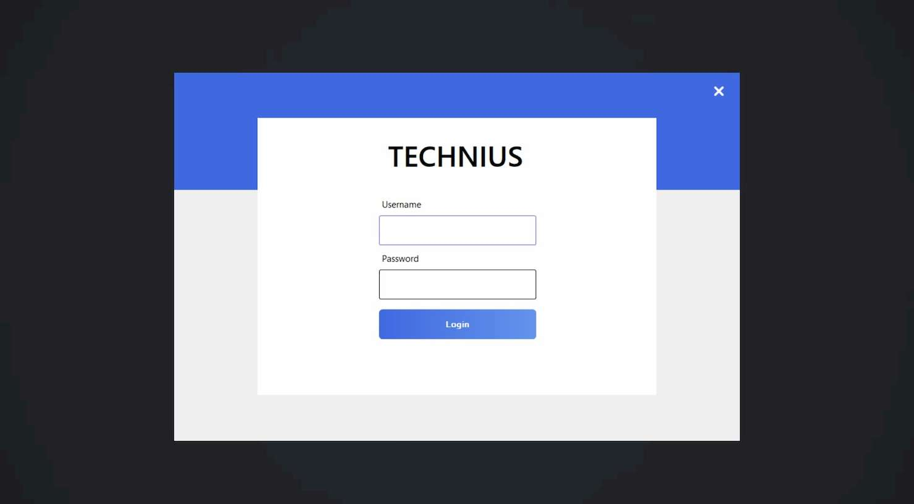
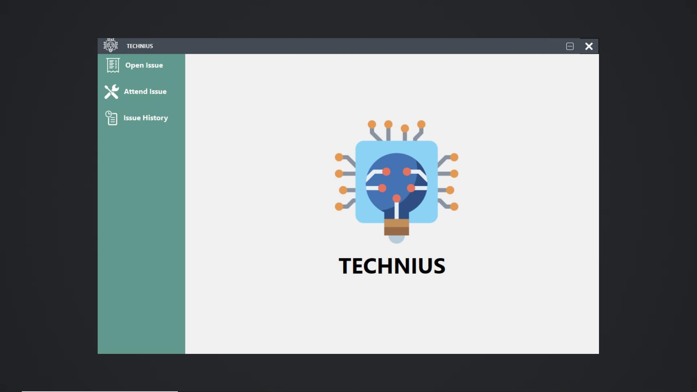
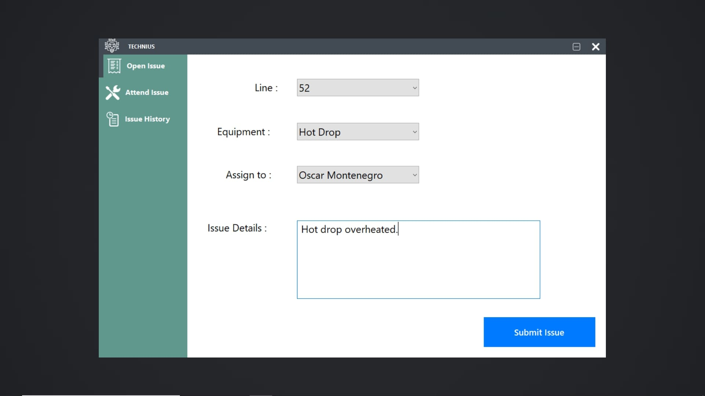
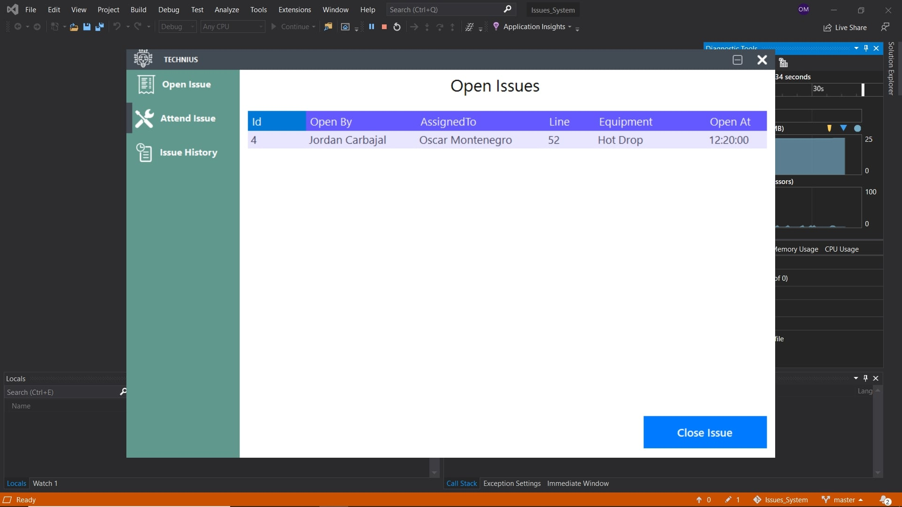
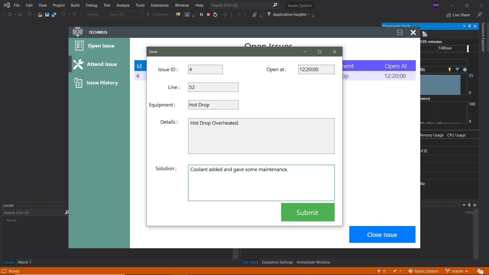
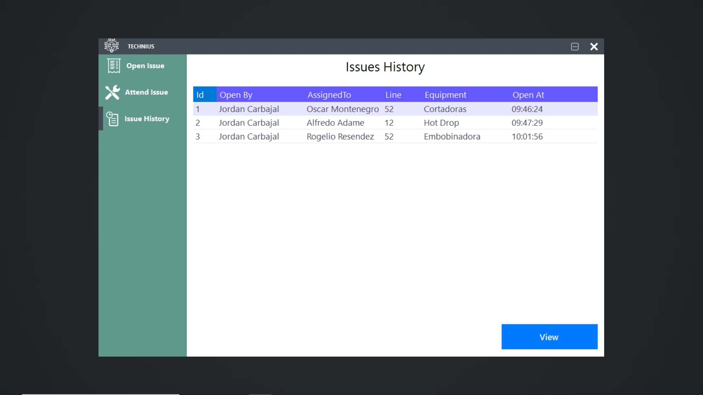

# Issues_System

System designed to handle issues on a manufactury environment delegating issues to a maintenance technician and controling the time
it has ben open and wuen its closed. It has user authorization when loged so there are task that only admins can perform while
technician have thei respective actions.

## Features
- Authentication
- Login system
- CRUD operations on Employees
- SQL Server used to store all data
- ADO.NET to connect to SQL SERVER
- CRUD operations on Issues
- Tables to view and manage all the Issues
- Issues history table to view all closed issues

### Admins can open issues and asign the task to the maintenance technicians.

### Users can acces their account and view the currently open issues that need attention and check if the task was assigned to them.

### This is how the details of an open issue look. THe maintenance technician must write down the solution provided to the open issue.

### All the solved issues are stored in the SQL SERVER Database and displayed in a table to be consulted in the future.

